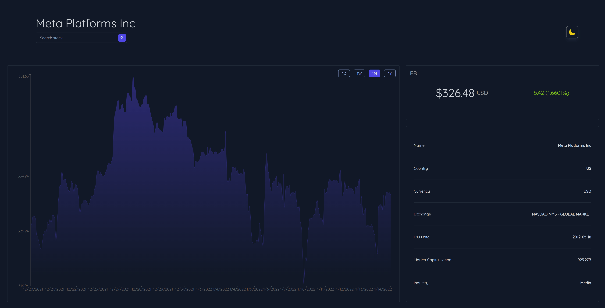
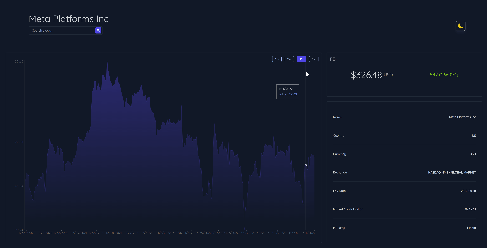

# Stock Dashboard App

## Description

This is a stock dashboard application built with React and Tailwind CSS. It allows users to search for stock symbols, view stock data, and analyze it using various chart filters. The application also features a theme selector for light and dark modes, and smooth CSS transitions for a better user experience.

## Features

- **Stock Search:** Enter stock symbols to search and view detailed information.
     
- **Chart Filters:** Filter data by day, week, month, or year to analyze stock trends.
   
- **Theme Selector:** Toggle between light and dark themes to suit your preference.
   
- **Responsive Design:** Optimized for both desktop and mobile views.
- **Smooth Transitions:** CSS transitions for a seamless user experience, including hover effects on buttons and icons.

## Technologies Used

- **React.js:** JavaScript library for building user interfaces.
- **Tailwind CSS:** Utility-first CSS framework for styling components.
- **React Context API:** For managing global state, such as selected stock and theme.
- **Chart.js:** For rendering interactive charts.
- **React Hooks:** Including `useState` and `useEffect` for managing state and side effects.
- **API Integration:** Fetches stock data from an external API.

## Installation

To get started with the project, follow these steps:

1. **Clone the repository:**

    ```bash
    git clone https://github.com/Abdelhamid-Mouloudi/stock-dashboard.git
    ```

2. **Navigate to the project directory:**

    ```bash
    cd stock-dashboard
    ```

3. **Install dependencies:**

    ```bash
    npm install
    ```

4. **Start the development server:**

    ```bash
    npm start
    ```

    Open [http://localhost:3000](http://localhost:3000) in your browser to view the application.

## Usage

- **Search for stocks:** Type the stock symbol into the search bar and press Enter or click the search button.
- **Filter chart data:** Use the chart filters to view data by day, week, month, or year.
- **Toggle theme:** Click the theme icon to switch between light and dark themes.

## Contributing

If you would like to contribute to this project, please fork the repository and submit a pull request with your changes.

## License

This project is licensed under the MIT License - see the [LICENSE](LICENSE) file for details.

## Acknowledgements

- [Create React App](https://reactjs.org/docs/create-a-new-react-app.html) for bootstrapping the project.
- [Tailwind CSS](https://tailwindcss.com/docs) for the styling framework.
- [Chart.js](https://www.chartjs.org/) for charting capabilities.
